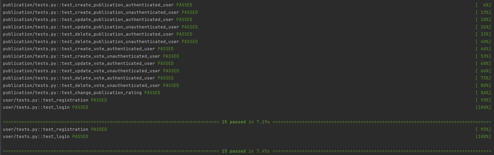

# Tripster-test-task

Проект задеплоен:  
<a href="http://95.163.231.52:8888/swagger/">swagger</a>  
<a href="http://95.163.231.52:8888/redoc/">redoc</a>
 

<ol>
    <li>Получаем access токен на эндпоинте 'user/register'</li>
    <li>Авторизируемся в сваггере, прописав в Authorize 'Bearer access_token'</li>
    <li>Пользуемся эндпоинтами</li>
</ol>

<h3>Локальный запуск</h3>
<ol>
    <li>Клонируем репозиторий 'git clone https://github.com/ArseniyZh/Tripster-test-task'</li>
    <li>Заходим в каталог 'app', устанавливаем зависимости 'pip install -r requirements.txt' и запускаем команду 'pytest'</li>
    <li>Прописываем в консоли 'docker compose up -d --build'</li>
    <li>Переходим на <a href="http://localhost:8888/swagger/">http://localhost:8888/swagger/</a></li>
    <li>Используем предыдущую инструкцию</li>
</ol>

<h4>Результат</h4>
<ul>
    <li>Добавление публикации (на вход — текст публикации) - ✅</li>
    <li>Просмотр списка из 10 публикаций последних самых рейтинговых - ✅</li>
    <li>Голосование за публикацию (+/- или отмена голоса) - ✅</li>
    Правила и ограничения:
    <li>Создавать публикацию и голосовать могут только авторизованные пользователи - ✅</li>
    <li>Один пользователь не может проголосовать за одну публикацию дважды. - ✅</li> 
    <li>Переголосовать или отозвать голос можно - ✅</li>
    <li>Рейтинг публикации считается как число плюсов - число минусов - ✅</li>
    <li>Данные о публикации должны содержать следующие данные: - ✅
        <ol>
            <li>Текст публикации</li>
            <li>Дата публикации</li>
            <li>Автор</li>
            <li>Число голосов</li>
            <li>Рейтинг</li>
        </ol>
    </li>
    <li>Сервис должен выдерживать нагрузку и обрабатывать ситуации с параллельными запросами на создание публикации, голосование и т.п. - ✅</li>
    <li>Дополнительным плюсом будет покрытие тестами (pytest) - ✅</li>
</ul>
 
<h4>Плюсом:</h4>
<ul>
    <li>Обернул в докер</li>
    <li>Задеплоил</li>
</ul>
 

  
